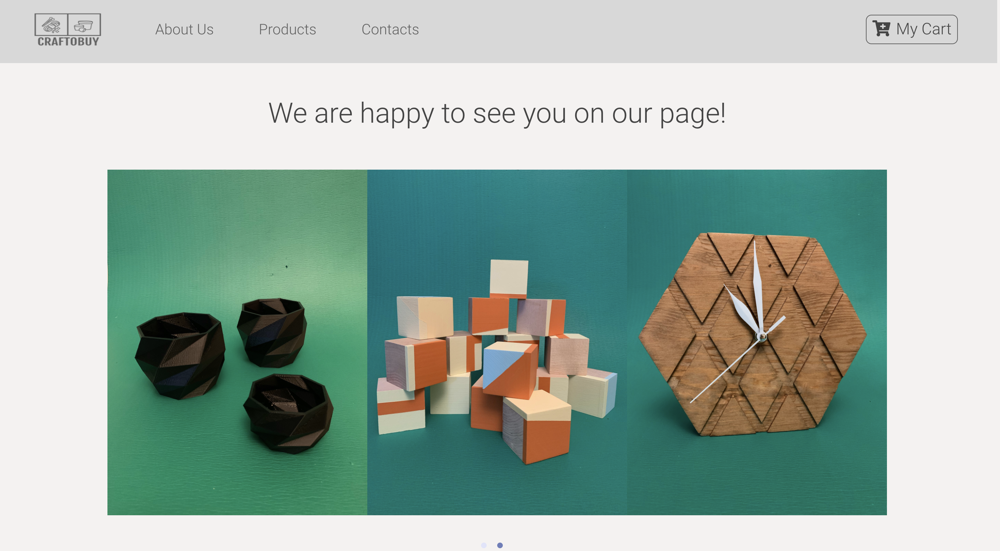
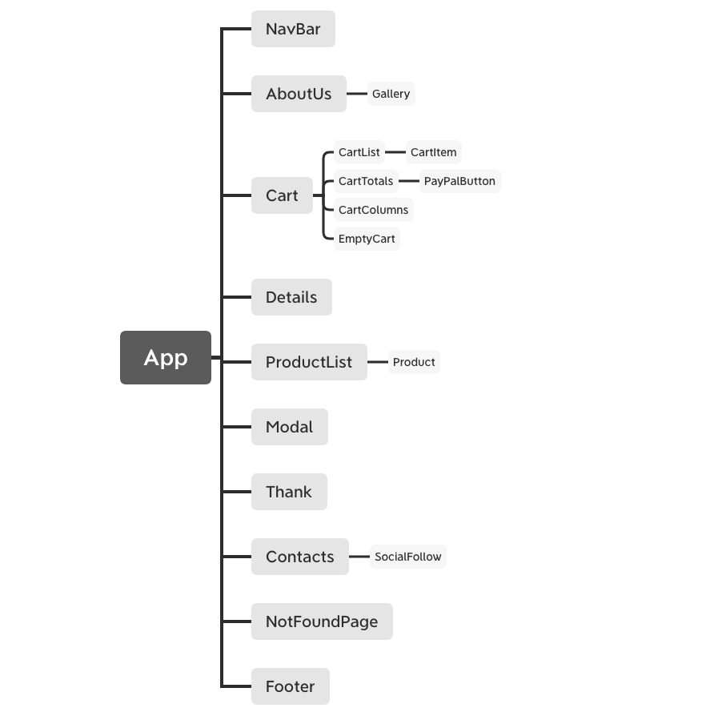

# CraftoBuy Store e-commerce website

#### Epicodus Independent Capstone Project

#### By _**Zinfira Safargalieva**_, 07/30/2020

## Description 



This is an e-commerce website that allow users to see information about creators, contacts details, products of CraftoBuy Store, see descriptions about products, price, be able to add desired items to the cart and accept payments using Sandbox PayPal.

[Click here](https://craftobuy.netlify.app) to see deployed version on Netlify.


## Component Tree




## Behavior Description

* A user is able to see carousel of  products on homepage https://craftobuy.netlify.app/

* A user is able to send an email https://craftobuy.netlify.app/contacts

* A user is able to go to Instagram page following the link on https://craftobuy.netlify.app/contacts

* A user is able a list of products on https://craftobuy.netlify.app/products

* A user is able to see a detail product page with information about product by clicking on product image 

* A user is able to add products to the cart by navigating to product image and clicking on `shop cart icon` OR by clicking on image and clicking on `Add To Cart` button

* A user is able to see a list of items added to the cart by clicking `My Cart` on navigation panel OR after adding items to the cart and clicking `Go To Cart` button

* A user is able to change quantity of items on [My Cart page](https://craftobuy.netlify.app/cart) by clicking `-` or `+` buttons

* A user is able to remove an item from `My Cart` by clicking on `trash can icon`

* A user is able to delete all items from the `My Cart` by clicking `CLEAR CART` button

* A user is able to buy items added to the cart by clicking on `PayPal` button 


## Setup/Installation Requirements

Clone this repository via Terminal (macOS) or PowerShell (Windows) using the following commands:

* >$ cd Desktop
* >$ git clone https://github.com/Zinfira/capstone_project.git
* >cd capstone_project

Open downloaded files in a text editor of your choice (VS Code for example). Confirm that you navigated to the `capstone_project` project directory by entering ```pwd``` in Terminal. Next, add a file named `.env.development` to the project's root directory or by entering the command `touch .env.development`in Terminal.

Next,

* Make an API key for the [PayPal Developer API](https://developer.paypal.com/developer/applications/) by navigating to the linked website and clicking "Login in to Dashboard". Then, in "My Apps & Credentials" click to "Create app" and give a name for your app. Later, use sandbox accounts to generate mock transactions to test your app and create two types of accounts: Personal and Business by following [these instructions](https://developer.paypal.com/docs/api-basics/sandbox/accounts/#create-and-manage-sandbox-accounts)

* Store your API key for the PayPal Developer API in `.env.development` file in the following format: `REACT_APP_APP_ID = {replace this curly braces and this text with Client ID from Sanbox API Credentials}`

* Add `.env.development` to `.gitignore` file

Next, install node package manager (npm) at the project's root directory via the following command:

* >$ npm install

Open this application via live server using the following command:

* >$ npm start

This command will start the server. Open the browser(Chrome) and input __localhost:3000__


## Known Bugs

_Seller PayPal account gets notifications about getting payments with delay._


## Support and contact details

_If you have any issues with the program or you have any suggestions, email me <zsafargalieva@gmail.com>_


## Technologies Used

_React, HTML, CSS, Bootstrap, JavaScript, JSX, Webpack, npm, Context API, [PayPal Developer API](https://developer.paypal.com/developer/applications/)


### License

*Licensed under [MIT](https://en.wikipedia.org/wiki/MIT_License) license*

Copyright (c) 2020 **_Zinfira Safargalieva_**